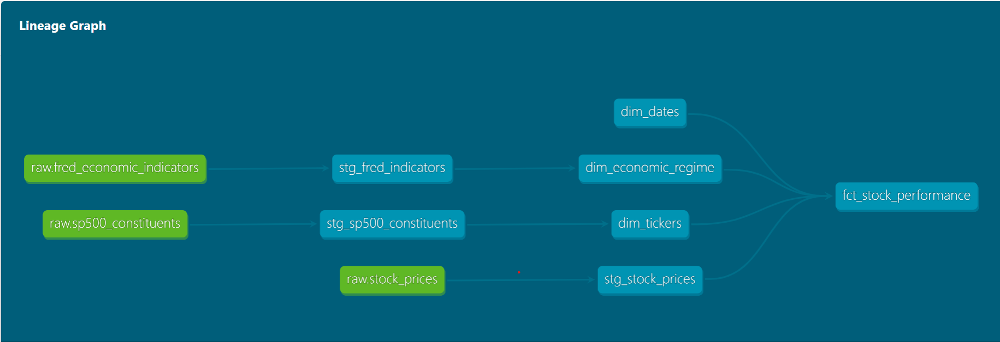
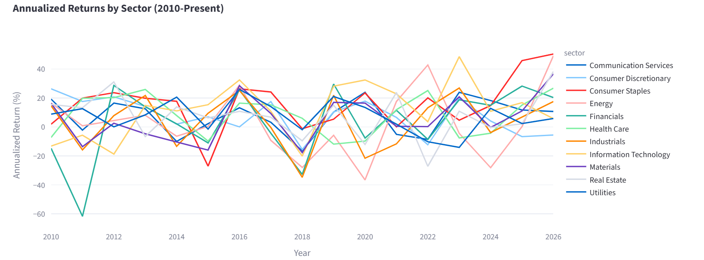
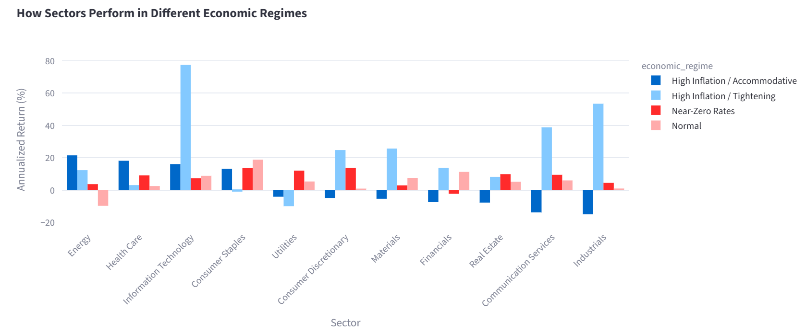
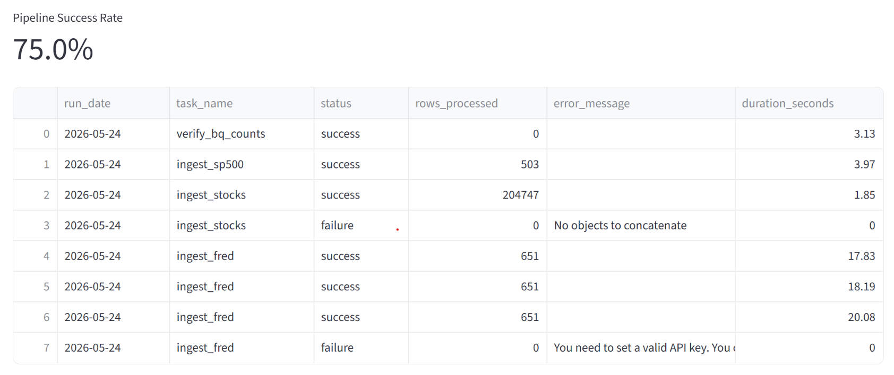

# Financial Markets Data Warehouse

End-to-end financial data warehouse on GCP BigQuery analyzing how macroeconomic regimes affect equity sector performance — orchestrated with Apache Airflow, transformed with dbt, and served via a Streamlit dashboard.


---

## Key Finding

During **High Inflation / Accommodative** periods (high inflation, low rates — 2020–2021), Energy and Health Care outperformed all other sectors at +21% and +18% annualized respectively, while Financials and Real Estate declined. During **High Inflation / Tightening** periods (2022), Information Technology led at +77% annualized — largely driven by the post-COVID recovery captured in that window. The warehouse surfaces these cross-regime signals across 14 years of data with a single join.

---

## Architecture



```
FRED API     → GCS (raw backup) → BigQuery raw layer
yfinance     → GCS (raw backup) → BigQuery raw layer
Wikipedia    →                    BigQuery raw layer

BigQuery raw → dbt staging (views) → dbt marts (tables)
                                      ├── dim_tickers
                                      ├── dim_dates
                                      ├── dim_economic_regime
                                      └── fct_stock_performance

Airflow DAG  → orchestrates ingestion → GCS sensor → BigQuery verification
Streamlit    → queries marts directly → sector and regime dashboards
```

---

## Dashboard

**Sector Returns by Year**



**Sector Performance by Economic Regime**



**Pipeline Health**



---

## Tech Stack

| Layer | Tools |
|---|---|
| Raw Storage | GCP Cloud Storage |
| Cloud Warehouse | BigQuery |
| Transformations | dbt-bigquery |
| Orchestration | Apache Airflow |
| Containerization | Docker + Docker Compose |
| CI/CD | GitHub Actions (pytest + flake8) |
| Dashboard | Streamlit + Plotly |
| Language | Python 3.12 |

---

## Data Sources

- **FRED API** — Federal Funds Rate, CPI, GDP, Unemployment (monthly/quarterly, 2010–present)
- **yfinance** — Daily OHLCV for 50 S&P 500 tickers across 10 sectors (2010–present)
- **Wikipedia** — S&P 500 constituents with sector and industry classifications

---

## dbt Models

**Staging layer (views):**
- `stg_fred_indicators` — cleaned macro indicators with frequency and name labels
- `stg_stock_prices` — normalized OHLCV with type casting and null filtering
- `stg_sp500_constituents` — standardized ticker and sector data

**Marts layer (tables):**
- `dim_tickers` — 503 S&P 500 companies with sector classification
- `dim_dates` — full date spine 2010–2026 with weekday, quarter, month attributes
- `dim_economic_regime` — monthly macro regime classification using Fed Funds Rate, CPI YoY, and unemployment
- `fct_stock_performance` — 204,747 rows joining prices to all three dimensions

**Data quality:** 33 dbt tests passing — uniqueness, not-null, referential integrity, and accepted values across all models.

---

## Pipeline

5-task Airflow DAG running daily:

```
ingest_fred → ingest_stocks → ingest_sp500 → check_gcs_sensor → verify_bq_counts
```

Every task logs to `raw.pipeline_logs` in BigQuery with status, rows processed, duration, and error messages.

---

## Results

| Metric | Value |
|---|---|
| Raw rows ingested | 205,901 |
| Fact table rows | 204,747 |
| dbt models | 7 (3 staging, 4 marts) |
| dbt tests passing | 33 |
| Tickers covered | 50 across 10 sectors |
| Date range | 2010–2026 |
| CI status | passing |

---

## Setup

**Prerequisites:** Python 3.12, Docker Desktop, GCP account with BigQuery and Cloud Storage enabled.

```bash
# 1. Clone the repo
git clone https://github.com/Mohit-03Sharma/financial-data-warehouse.git
cd financial-data-warehouse

# 2. Add your GCP credentials file (service account JSON) to the project root
# Never commit this file — it is in .gitignore

# 3. Set environment variables
set GOOGLE_APPLICATION_CREDENTIALS=your-credentials.json
set FRED_API_KEY=your_fred_api_key

# 4. Install dependencies
python -m venv venv
venv\Scripts\activate
pip install -r requirements.txt

# 5. Run ingestion scripts
python ingestion/fred_ingestion.py
python ingestion/yfinance_ingestion.py
python ingestion/sp500_ingestion.py

# 6. Start Airflow
docker compose up airflow-init
docker compose up airflow-webserver airflow-scheduler -d

# 7. Run dbt transformations
cd dbt/financial_dw
dbt deps
dbt run
dbt test

# 8. Launch dashboard
cd ../..
streamlit run dashboard/app.py
```